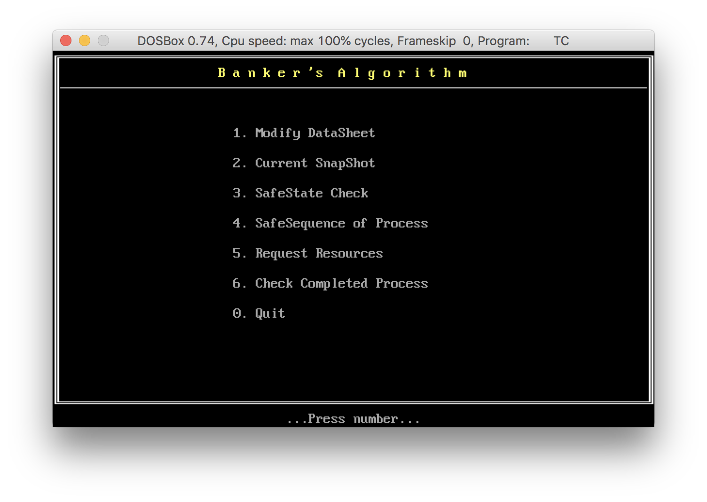
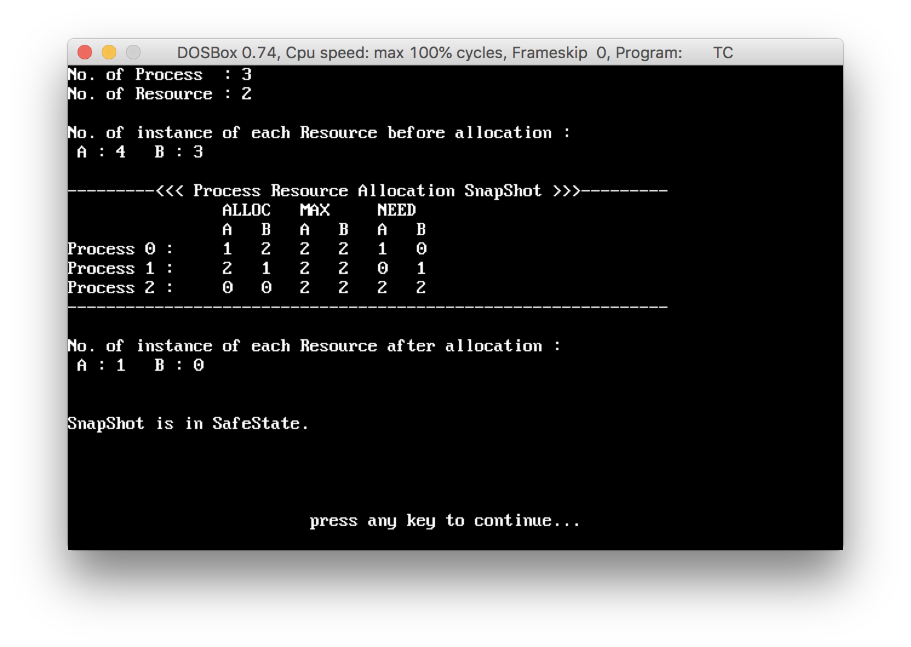
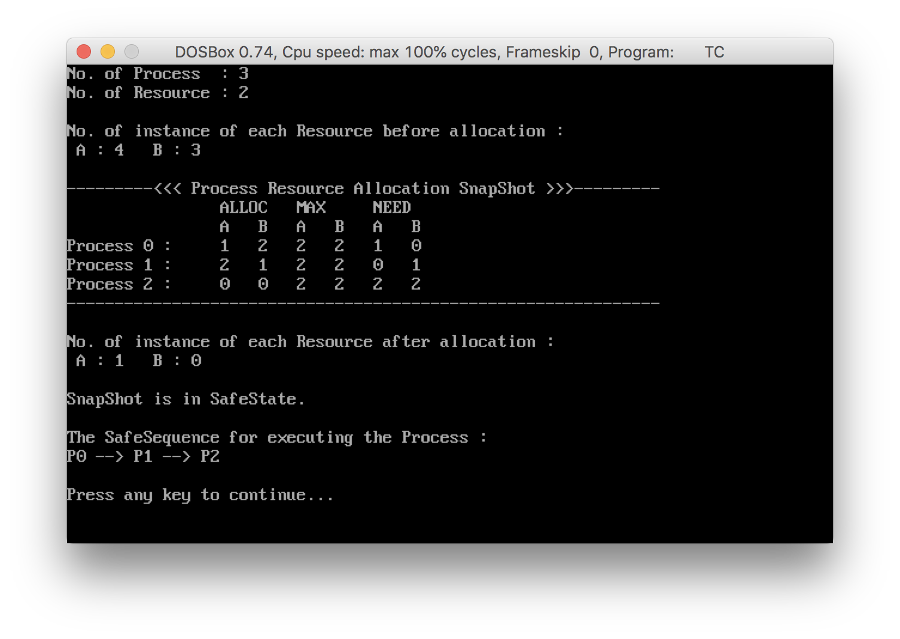
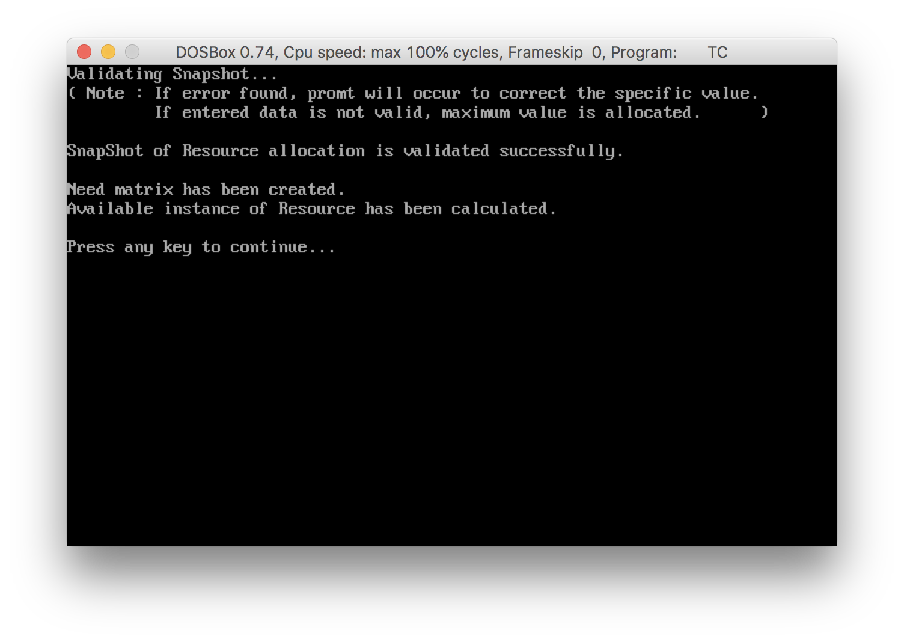
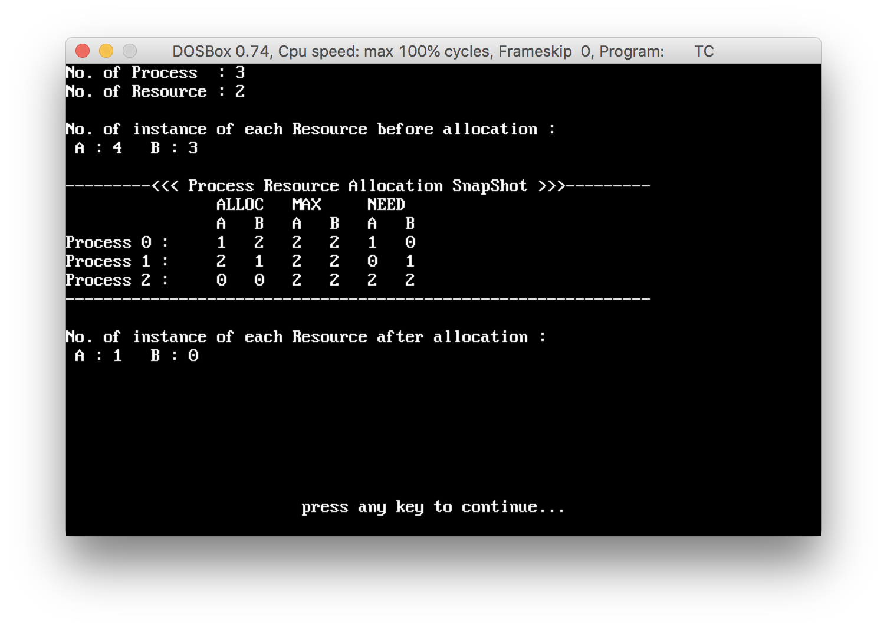
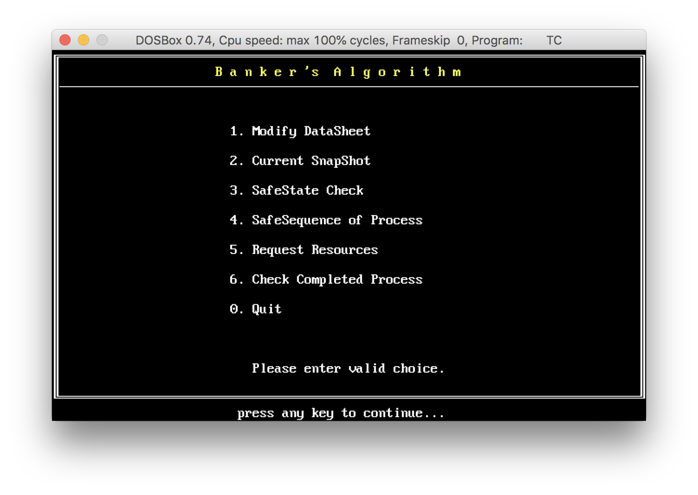
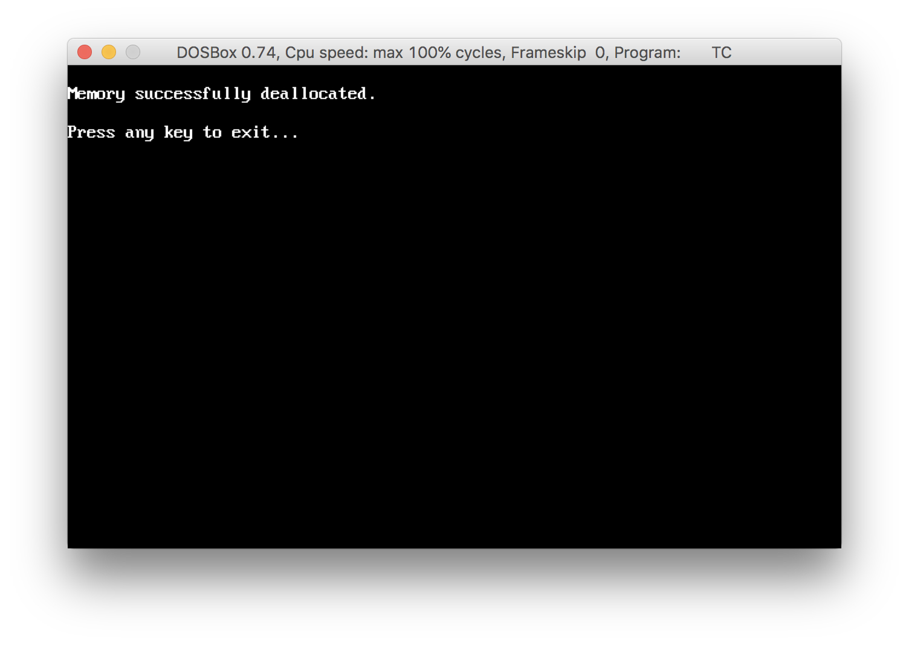

# :bank: Banker's Algorithm :books:

Banker’s Algorithm, which is a deadlock avoidance algorithm. It is called the Banker’s Algorithm, because it could be used by a bank to make sure that money is allocated in such a way that all customer needs are met. When a new process enters the system, it declares the maximum number of instances that are needed. This number cannot exceed the total number of resources in the system. If the process can be accommodated based upon the needs of the system, then resources are allocated, otherwise the process must wait. The algorithm is actually made up of two separate algorithms: the safety algorithm and the resource allocation algorithm.

*This program is tested using Borland C++ Compiler.*

## File Structure
| File Name | Description |
| --- | --- |
| BANKER.CPP | main application |
| CLASS.CPP | banker class declaration |
| DEFINE.CPP | banker class definitions |
| GRAPHICS.CPP | graphics related functions |

## Data Structures
The following data structures are needed:

`no_of_process` represents the number of processes and `no_of_resource` represents the number of resource types.

1. Available
    1. A vector (array) of available resources of each type
    2. If `available[j] = k`, then `k` instances of `R`j are available.

2. Max
    1. A `n` `no_of_process` by `no_of_resource` matrix
    2. Defines maximum demand for each process
    3. `maximum[i][j] = k`, then process `P`i may request at most `k` instances of resource `R`j.

3. Allocation
    1. A `n` `no_of_process` by `no_of_resource` matrix
    2.Defines number of resources of each type currently allocated to each process
    3. `allocation[i][j]=k`, then process `P`i is currently allocated `k` instances of `R`j.

4. Need
    1. A `n` `no_of_process` by `no_of_resource` matrix
    2. Indicates remaining resource need of each process
    3. If `need[i][j] = k`, then process `P`i needs `k` more instances of `R`j.
    4. `need[i][j] = maximum[i][j] - allocation[i][j]`

## Screenshots
### Application
> Main Application Window

### Algorithm

> Safe Sequence Check

> Safe Sequence Result

> Algorithm Inprogress

> Current State

### Extra Flows
> Input Validation

> Memory Deallocation

